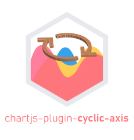

<p align="center">
  
</p>

<p align="center">
  <a href="//npmjs.com/package/chartjs-plugin-cyclic-axis"></a>
  <a href="https://github.com/maorassayag/chartjs-plugin-cyclic-axis/issues"></a>
  <a href="https://github.com/wisehackermonkey/zalgo-string-generator/stargazers"></a>
  <a href="https://github.com/maorassayag/chartjs-plugin-cyclic-axis/blob/master/LICENSE"></a>
</p>

## Overview

Chart.js plugin that enables cyclic pan functionality in linear scatter charts :bar_chart:

Live Demo [github page](https://maorassayag.github.io/chartjs-plugin-cyclic-axis/)

#
### Installation
`npm install --save chartjs-plugin-cyclic-axis`

### Usage
- import the plugin
```js
import * as cyclicAxisPlugin from 'chartjs-plugin-cyclic-axis';
```

- Register the plugin
 ```js
Chart.register(cyclicAxisPlugin);

```
- Declare custom axis
```js
    var myChart = new Chart(this.ctx, {
      type: 'scatter',
      data: [],
      options: {
        scales: {
          x: {
            display: true,
            type: 'cyclicAxis' as any, // 'cyclicAxis' is this plugin custom axis ID
            min: -180,
            max: 180,
            rightValue: 180,
            cyclicPanning: true,
            ticks: {
              stepSize: 5,
            } as any,
          } as any,
        },
     }
    );
```
See the [plugins](http://www.chartjs.org/docs/latest/developers/plugins.html) documentation for more info.

### Example with [zoom plugin](https://github.com/chartjs/chartjs-plugin-zoom) 
```js
    this.myChart = new Chart(this.ctx, {
      type: 'scatter',
      data: data, // predefined random data
      options: {
        scales: {
          x: {
            display: true,
            type: 'cyclicAxis' as any,
            min: -180,
            max: 180,
            rightValue: 180,
            cyclicPanning: true,
            ticks: {
              stepSize: 5,
            } as any,
          } as any,
        },
        plugins: {
          zoom: {
            pan: {
              // pan options and/or events
              enabled: true,
              mode: 'x',
              overScaleMode: 'x',
            },
            limits: {
              // axis limits
              y: {min: 0, max: 100},
              x: {min: -180, max: 180},
            },
            zoom: {
              // zoom options and/or events
              mode: 'y',
              wheel: {
                enabled: true,
              },
            }
          },
        }
      }
    });
```
Full Angular example is available [here](https://github.com/MaorAssayag/chartjs-plugin-cyclic-axis/tree/main/cyclic-example).

### Options
The plugin options can be changed in the `scales` options per chart:

The default chart options are:

```js
options: {
  scales: {
    x: {
      display: true,
      type: 'cyclicAxis' as any,
      min: -180,
      max: 180,
      rightValue: 180,
      cyclicPanning: true,
      ticks: {
        stepSize: 5,
      } as any,
    } as any,
  },
}
```

Chart options:

`max`: ([Number]) max value of tick range.

`min`: ([Number]) min value of tick range.

`rightValue`: ([Number]) initialize tick value on the right of the graph

`ticks.stepSize`: ([Number]) diff between ticks

# Warning

This is not supposed to be used in production. It is a first try to accomplish basic custom pan functionallity in a certain way. You are not forced to do everything exactly as it is shown here, decide what works best for you and your team.
However, this is a great staring point for custom development for whatever special usecase.
